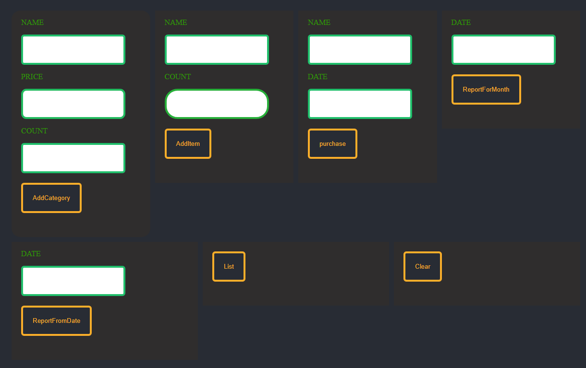

To run app you need Node.js v14.13.1

First open project in IDE, open terminal 'cd .\server\'
install all dependencies with 'npm i'
then run 'node app.js'
Server started! all right!!!!

Second open one more terminal window run 'cd .\fe-test\'
install all dependencies with 'npm i'
then run 'npm run start'

here is image of UI part

add your data to inputs and press button below
happy hacking
